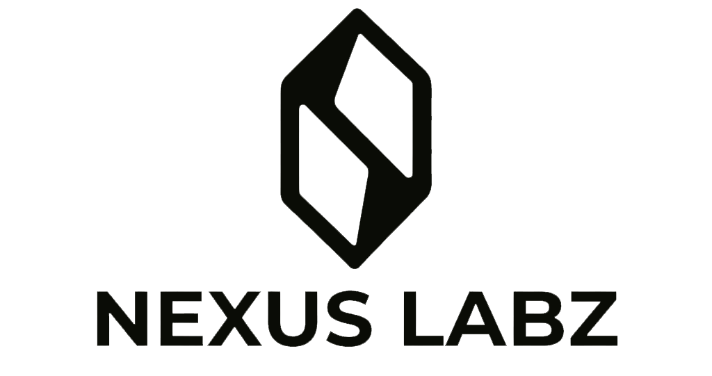

<p align="center">
  <picture>
    <source media="(prefers-color-scheme: dark)" srcset="shared/assets/logos/logo-full-no-bg-white.png">
    <source media="(prefers-color-scheme: light)" srcset="shared/assets/logos/logo-full-no-bg-black.png">
    
  </picture>
</p>

<h1 align="center">Showcase</h1>

<p align="center">
  Centralized repository for all Nexus Labz presentations.<br/>
  Each presentation is an independent project within a monorepo, built with <a href="https://sli.dev/">Slidev</a> (Vue 3 + Vite) and published as static HTML via GitHub Pages.
</p>

## Presentations

| Presentation      | Description     | Dev                        | Build                        |
| ----------------- | --------------- | -------------------------- | ---------------------------- |
| `brand-guideline` | Brand Guideline | `yarn dev:brand-guideline` | `yarn build:brand-guideline` |
| `team`            | Our Team        | `yarn dev:team`            | `yarn build:team`            |
| `projects`        | Projects        | `yarn dev:projects`        | `yarn build:projects`        |
| `results`         | Results         | `yarn dev:results`         | `yarn build:results`         |

## Prerequisites

- [Node.js](https://nodejs.org/) >= 20
- [Yarn](https://classic.yarnpkg.com/) 1.22+

## Installation

```bash
git clone git@github.com:nexuslabz/nexuslabz-showcase.git
cd nexuslabz-showcase
yarn install
```

## Development

Open a presentation in the browser with hot-reload:

```bash
yarn dev:brand-guideline
```

Edit the `presentations/brand-guideline/slides.md` file and see changes in real time.

## Build

Generate the static HTML for a single presentation:

```bash
yarn build:brand-guideline
```

Generate all presentations at once:

```bash
yarn build:all
```

Output files are located at `presentations/<name>/dist/`.

## Project Structure

```
nexuslabz-showcase/
├── .github/
│   ├── workflows/          # GitHub Actions (deploy)
│   └── dependabot.yml      # Automated dependency updates
├── .husky/                 # Git hooks (pre-commit with lint-staged)
├── config/
│   ├── eslint.config.mjs   # ESLint (flat config)
│   └── prettier.config.mjs # Prettier
├── packages/
│   └── theme-nexuslabz/    # Shared theme (layouts, components, styles)
├── presentations/
│   ├── brand-guideline/    # Presentation: Brand Guideline
│   ├── team/               # Presentation: Our Team
│   ├── projects/           # Presentation: Projects
│   └── results/            # Presentation: Results
├── scripts/                # Automation scripts (build-all)
├── shared/
│   └── assets/             # Shared assets
│       ├── logos/           # NexusLabz logos
│       └── images/         # Global images
└── package.json            # Root (Yarn workspaces)
```

## Creating a New Presentation

1. Create a folder under `presentations/`:

```bash
mkdir -p presentations/new-presentation/public
```

2. Create the workspace `package.json`:

```json
{
  "name": "@nexuslabz/new-presentation",
  "version": "1.0.0",
  "private": true,
  "scripts": {
    "dev": "slidev slides.md --open",
    "build": "slidev build slides.md --base /nexuslabz-showcase/new-presentation/"
  },
  "dependencies": {
    "@slidev/cli": "latest",
    "@slidev/theme-default": "latest"
  }
}
```

3. Create the `slides.md`:

```markdown
---
title: New Presentation - NexusLabz
---

# Presentation Title

First slide content.

---

# Second Slide

Second slide content.
```

4. Add the scripts to the root `package.json` and run `yarn install`.

## Available Scripts

| Command             | Description                                     |
| ------------------- | ----------------------------------------------- |
| `yarn dev:<name>`   | Start the development server for a presentation |
| `yarn build:<name>` | Generate static HTML for a presentation         |
| `yarn build:all`    | Generate HTML for all presentations             |
| `yarn lint`         | Run ESLint across the project                   |
| `yarn lint:fix`     | Auto-fix issues with ESLint                     |
| `yarn format`       | Format all files with Prettier                  |
| `yarn format:check` | Check if files are properly formatted           |

## Code Quality

- **ESLint** with flat config (Vue 3 + Prettier)
- **Prettier** for consistent formatting
- **Husky** + **lint-staged** on pre-commit
- **Dependabot** for weekly dependency updates

## Tech Stack

- [Slidev](https://sli.dev/) — Presentation framework for developers
- [Vue 3](https://vuejs.org/) — UI framework
- [Vite](https://vite.dev/) — Build tool
- [UnoCSS](https://unocss.dev/) — CSS engine (built into Slidev)
- [Yarn Workspaces](https://classic.yarnpkg.com/en/docs/workspaces/) — Monorepo

## License

Internal use only — Nexus Labz. All rights reserved.
